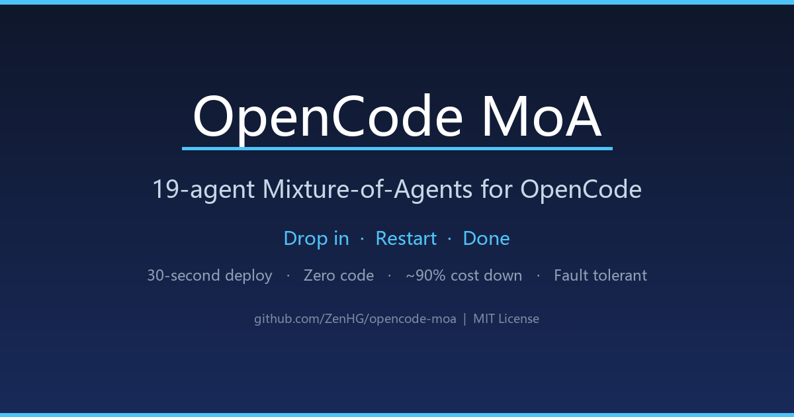
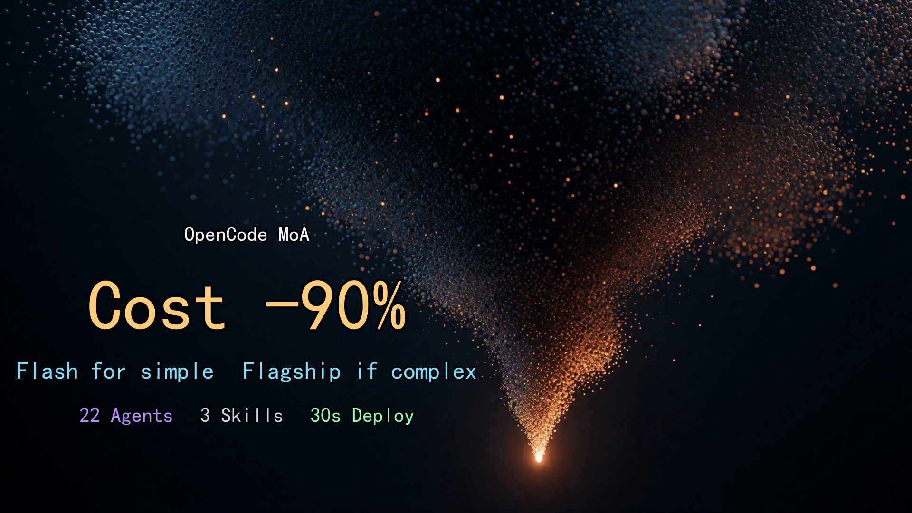
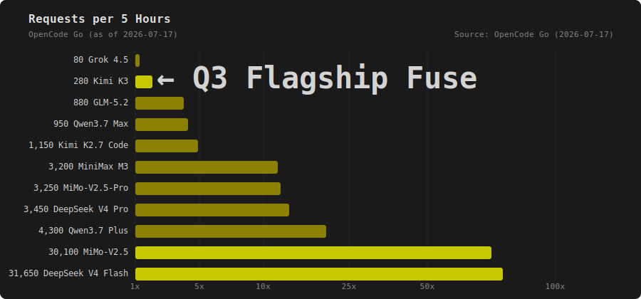

# OpenCode MoA

> 🌐 Languages: [English](README.md) · [中文](README.zh.md) · 日本語 · [한국어](README.ko.md) · [Español](README.es.md) · [Français](README.fr.md) · [Deutsch](README.de.md)

[](LICENSE)
[](CONTRIBUTING.md)
[](https://opencode.ai)

> 🔥 **新着 (2026-07):** フラグシップ融合を **Kimi K3** にアップグレード — 2.8T パラメータ、1M コンテキスト、トップティア前沿モデル。OpenCode Go 割り当ては 7/24 まで 2 倍 (140 → 280 / 5h、その後 140 に戻る)。

> **1つの会話入口で、22個の専門モデルが自動的に協調します。簡単なタスクは Flash（低コスト）、複雑なタスクだけ flagship（高コスト）を呼び出します。コストは最大約90%削減（全て flagship の場合と比較）、コード品質は大幅に向上します。 単純タスクが主体て flagship 呼び出しが最小限のとき、実際の削減はタスク構成に依存します。**



OpenCode MoA は OpenCode 用の Mixture of Agents 設定パッケージです。複数のモデルが**同じ問題を同時に考え**、単一モデルでは到達しにくい品質の出力へ統合します。ツールを切り替えたり、コードを書いたり、API クォータを用意したりする必要はありません。ファイルをプロジェクトに置き、OpenCode を再起動するだけです。

**22 agents · 5 commands · 3 skills · 30秒デプロイ**

---

## なぜ必要ですか？

デフォルトの OpenCode は、最初から最後まで単一モデルで処理します。1文字の修正もシステムアーキテクチャ設計も、同じ prompt、同じ temperature、同じ context を使います。分業がありません。

**3つの問題:**

1. **コストが制御しにくい** — 簡単なタスクにも高価なモデルを使い、月額コストが高くなる
2. **品質のボトルネック** — 単一モデルには1つの考え方しかなく、盲点に入りやすい
3. **耐障害性がない** — モデルが失敗すると停止し、fallback がない

**MoA の解決策:**

```text
あなた: メッセージキュー設計を手伝って

    ┌─ flag-arch (Qwen3.7 Max)     ─── アーキテクト視点の案
    ├─ flag-plan (GLM 5.2        ) ─── PM視点の案
    ├─ flag-eng  (MiniMax M3 )     ─── 実装者視点の案
    └─ flag-fuse (Kimi K3)         ─── それぞれの長所を統合し、最適案にする


```

3つの異なるモデルによる独立した案は、自然に「合意 + 差分」の構造を作ります。融合モデルは合意部分を保持し、差分部分では最良の要素を選びます。これは単一モデルでは難しいことです。

---

## 前提条件

### 必須

| 要件 | 確認コマンド | メモ |
| --- | --- | --- |
| OpenCode installed | `opencode --version` | **>= 1.3.4**（agent-level `reasoningEffort`/`hidden`/`task` 対応、`openai-compatible` provider は reasoning を透過的に渡すため `forceReasoning` 不要）、[install](https://opencode.ai/install) |
| OpenCode Go plan | opencode.ai console | [Subscribe](https://opencode.ai/auth)、初月 $5、その後 $10/月 |
| Git installed | `git --version` | repo の clone に使用 |
| OpenCode Go API Key | opencode.ai console で作成 | Zen console（opencode.ai）で作成 |

### 任意（install scripts に必要）

| 要件 | 確認コマンド | メモ |
| --- | --- | --- |
| PowerShell Core | `pwsh --version` | install.ps1 に必要。Windows 同梱、または `brew install powershell` |
| jq | `jq --version` | install.sh の JSON merge に必要。`apt install jq` / `brew install jq` |

> pwsh/jq がなくても問題ありません。Method 1（AI auto-deploy）または Method 3（manual merge）を使えます。

### Desktop vs CLI

- **CLI**: すべての方法に対応
- **Desktop**: Method 1（AI auto-deploy）が最も便利。Methods 2/3 は先に terminal 操作が必要

> ⚠️ **system-level key path は間違えやすい** — 正しいパスは下の「デプロイ前に読む」を参照してください。間違えると「deployment succeeds but all agents can't connect」になります。

> ⚠️ **デプロイ前に読む: key path を間違えない**
> provider + key は **project-level `opencode.json`**（デフォルト、自包含）または **system-level** 共有パスのどちらか一方に置きます。
> system-level を使う場合、正しいパスは:
>
> - Linux/macOS `~/.config/opencode/opencode.json`
> - Windows `%USERPROFILE%\.config\opencode\opencode.json`（**`%APPDATA%\opencode` ではありません**）
>   間違った system-level path は「deployment succeeds but all agents can't connect」につながります。

---

## 30秒デプロイ

### Method 1: AI auto-deploy（推奨）

1. [`docs/opencode-moa.en.md`](https://github.com/ZenHG/opencode-moa/blob/master/docs/opencode-moa.en.md) をダウンロード
2. OpenCode にそのドキュメントをアップロードし、送信:

> Deploy all 22 agents, 5 commands, and 3 skills from this manual into the current project

3. AI がすべてのファイルを自動作成します。完了後、**OpenCode を再起動**してください。

> 手動でファイルを作る必要はありません。このデプロイ手順書自体がインストーラです。

### Method 2: one-click install script（script version · CLI-friendly）

```bash
# clone the repo
git clone https://github.com/ZenHG/opencode-moa.git

# enter your project directory
cd your-project

# copy the .opencode directory from the repo
cp -r ../opencode-moa/.opencode/ .

# run the install script (auto-merge config, keeps your API key)
# Windows:
pwsh ../opencode-moa/install.ps1
# Linux/macOS:
bash ../opencode-moa/install.sh
```

> install script は元の `opencode.json` を自動バックアップし、provider と API key を保持したまま MoA config だけを merge します。
>
> Note: この方法は repo 同梱の `.opencode/` をそのままコピーします。agents は**中国語表示名**です。英語名の agents（`@english-name` で呼びやすい）を使いたい場合は Method 1 を使ってください。

### Method 3: manual install

```bash
# 1. clone the repo
git clone https://github.com/ZenHG/opencode-moa.git

# 2. copy the .opencode directory
cp -r opencode-moa/.opencode/ your-project/

# 3. manually merge opencode.json (do NOT replace directly!)
# open opencode.json, merge MoA's permission.task and agent sections in
# keep your existing provider and model config
```

> ⚠️ `cat >>` で append しないでください。JSON format が壊れます。直接置き換えもしないでください。API key を失います。
>
> Note: この方法は repo 同梱の `.opencode/` をそのままコピーします。agents は**中国語表示名**です。英語名の agents（`@english-name` で呼びやすい）を使いたい場合は Method 1 を使ってください。

### デプロイ成功の確認方法

1. OpenCode 再起動後、`Tab` で agents を切り替え（Windows desktop client は `Ctrl+.` も可）、「concierge-router」が見える
2. `@tool-handler` と入力して応答する
3. verification script を実行: `pwsh .opencode/tests/T0-static-verify.ps1`（deploy 中に manual Block 5.5 が生成）、期待値は all PASS（FAIL=0。system-level key の場合 WARN も pass）

### one-click rollback

```bash
rm -rf your-project/.opencode/
# manually restore your opencode.json (the install script auto-backs up a .bak file)
```

---

## 使い方

**何も学ばず、そのまま話してください。** concierge-router がタスクの複雑度を自動判断し、対応する agent chain に dispatch します。

| 入力例 | concierge-router の動作 | 使用 agents |
| --- | --- | --- |
| "rename this variable" | simple task と判定 | swift (Flash) |
| "write a user auth module" | tool layer gathers → 3 mid-tier parallel → fuse | tool-handler + mid-tier trio + fuse |
| "design a microservice architecture" | tool layer gathers → 3 flagship parallel → fuse → implement → QA | full-chain 6 agents |
| "restore this screenshot's UI" | 3 frontend experts parallel → lead picks best | frontend quartet |
| screenshot 付き message | vision-translator が text 化 → normal routing | vision-translator |

**直接 `@` 呼び出し:**

```text
@swift help me write a hello world
@tool-handler search all TODOs in the project
@flag-arch design a message queue solution
```

**one-click commands:**

| Command | Scenario |
| --- | --- |
| `/moa-quick` | simple task, translation, config change |
| `/moa-medium` | function module, bug fix, single-file refactor |
| `/moa-flagship` | system architecture, large refactor |
| `/moa-frontend` | UI restore, CSS, screenshot fix |
| `/moa-describe` | screenshot/image to text |

---

## アーキテクチャ

```text
                      concierge-router (Flash)
                                 │
                ┌────────────────┼─────────────────┐
                ▼                ▼                 ▼
             Tool layer     Opinion layer       Fusion layer
             Flash + MiMo   3 parallel opinions take the best
             (~80% calls)   (~18% calls)        (~2% calls)
```

**Tool layer**（Flash + MiMo）— code read、file search、screenshot to text。安価で高速、気軽に呼べます。

**Opinion layer**（MiniMax / DeepSeek Pro / Qwen / MiMo-Pro）— 異なる視点から plan を作ります。3つの意見は自然に「合意 + 差分」を形成します。

**Fusion layer**（Kimi / Qwen-Max / GLM / DeepSeek Pro fallback）— 合意を保持し、差分では最良を選びます。fusion 失敗時は DeepSeek V4 Pro に fallback します。

> ⚠️ 以下の call-volume ratios（~80% / ~18% / ~2%）は**設計目標**であり、実測統計ではありません。実際の比率はタスクの複雑度によって変わります。

---

## 22 Agents

```text
concierge-router (门童路由员, Flash)
 │
 ├── Tool layer ─────────────────────────────────────────────
 │   tool-handler      (工具人,      Flash ) read code, search files [+ material self-check]
 │   tool-handler-mimo (工具人-mimo, MiMo  ) reliable file read (fallback + parallel) [hidden]
 │   swift             (闪电侠,      Flash ) simple tasks in one shot
 │   vision-translator (视觉翻译官,  MiMo  ) screenshot/UI/error image to text
 │
 ├── residual-extractor  (残差提取者,  Flash     ) analyze divergence between plans
 ├── confidence-assessor (置信度评估者, DS Pro    ) assess fusion result confidence
 │
 ├── Mid-tier opinion layer ─────────────────────────────────────────────
 │   mid-eng      (中级·工程, Kimi K2.6   ) engineering view
 │   mid-creative (中级·创意, Qwen3.7 Plus) creative view
 │   mid-coder    (中级·码农, Flash       ) pragmatic view
 │   mid-fuse     (中级·融合, Kimi        ) fuse three plans [max_tokens: 16384]
 │
 ├── Flagship opinion layer ─────────────────────────────────────────────
 │   flag-arch (旗舰·架构, Qwen3.7 Max ) top-level architecture
 │   flag-plan (旗舰·规划, GLM 5.2   ) structured planning
 │   flag-eng  (旗舰·工程, MiniMax M3  ) large-scale implementation
 │   flag-fuse (旗舰·融合, Kimi K3     ) fuse three architecture plans [max_tokens: 16384]
 │   flag-impl (旗舰·实现, Flash       ) implement per fused plan [hidden]
 │   flag-qa   (旗舰·质检, DeepSeek Pro) plan review + code acceptance [max_tokens: 16384]
 │
 └── Frontend opinion layer ─────────────────────────────────────────────
     fe-restore (前端·还原, MiMo        ) pixel-perfect UI restore
     fe-logic   (前端·逻辑, Qwen3.7 Plus) component architecture & state mgmt
     fe-motion  (前端·动效, MiMo-Pro     ) interaction & motion
     fe-lead    (前端·总工, GLM-5.2      ) pick best of three frontend plans [max_tokens: 16384]
 ```

Fallback agent (not in the router chain above, called only when fusion fails):
```text
fallback (融合·保底, DeepSeek V4 Pro) — same residual-enhanced fusion, used when flag-fuse / mid-fuse / fe-lead fail
 ```

---

## 耐障害性設計

### Tool layer のフォールバックチェーン

Tool layer が失敗しても固まりません。自動的に downgrade します:

```text
tool-handler (Flash) failed → immediate retry once
  → retry succeeds → return normally
  → retry fails → tool-handler-mimo (MiMo) failed → immediate retry once
    → retry succeeds → return normally
    → retry fails → ask user:
      A. wait a few minutes and retry
      B. skip tool layer, call opinion layer directly (higher cost)
      C. switch to free model
```

> 多くの provider errors（502/503/timeout）は一時的です。素早い retry で成功することが多いです。

### Fusion layer のフォールバック

primary fusion agent が失敗した場合（STUCK / ERROR_PROVIDER / timeout / empty result）、concierge-router は自動的に `@融合·保底`（DeepSeek V4 Pro）へ fallback します:

```text
flag-fuse (旗舰·融合, Kimi K3) failed
  → task(@融合·保底) (DeepSeek V4 Pro) → output fallback result
mid-fuse (中级·融合, Kimi) failed
  → task(@融合·保底) (DeepSeek V4 Pro) → output fallback result
fe-lead (前端·总工, GLM-5.2) failed
  → task(@融合·保底) (DeepSeek V4 Pro) → output fallback result
```

fallback agent は同じ residual-enhanced fusion process を使います。

### MCP 権限分離

Opinion-layer agents は直接 code を読むことを禁止されています（`read: deny` + `bash: deny`）。tool layer を迂回して材料を取得することを防ぎます:

- Tool layer: code read / file search が可能（`read`/`bash` access）
- Opinion layer: `read: deny` + `bash: deny`、tool layer が提供した材料に基づいて plan するだけ
- Fusion layer: 同じ制限。3つの opinions だけに基づいて fuse

> Note: この project は MCP servers を設定していません。「MCP permission isolation」は MCP server-level isolation ではなく、agent-level tool restrictions（`read: deny` / `bash: deny`）を指します。

### 材料なしのフォールバック

Opinion layer が呼ばれたが材料がない場合（tool layer が完全失敗）、ユーザーに尋ねます:

- "give plan directly" を選ぶ → requirement description に基づく純粋な logical reasoning（code read なし）
- "wait for tool layer" を選ぶ → WAITING を出力し、tool layer 復旧後に retry

### エラー分類

Tool layer は失敗時に明確な error category を出力し、盲目的に retry しません:

- `ERROR_PROVIDER` — server 502/503/timeout
- `ERROR_AUTH` — auth failure
- `ERROR_UNKNOWN` — other errors

---

## コスト

### なぜ約90%節約できるのか

MoA は call-volume-weighted mix で課金を考えます。~80% tool-layer Flash、~18% mid-tier、~2% flagship。下の cost table の per-unit prices で effective output unit price を見積もります:

> **Important**: 80/18/2 の比率は architecture が設計した**想定 call volume distribution**であり、実測 cost proportion ではありません。実際の使用量は task type と complexity に依存します。

| Layer      | Share | Output unit price /1M                                                                                | Weighted |
| ---------- | ----- | ---------------------------------------------------------------------------------------------------- | -------- |
| Tool layer | 80%   | $0.28                                                                                                | $0.224   |
| Mid tier   | 18%   | ~$2.10 (MiniMax $1.20 / DeepSeek Pro $3.48 / Qwen Plus $1.60 / Kimi K2.7 $4.00 mid-fuse avg)       | $0.378   |
| Flagship   | 2%    | ~$6.00 (Qwen/GLM/MiniMax ~$4-7 + Kimi K3 $15.00 flag-fuse)                                         | $0.12    |

混合後の有効出力単価は ≈ **$0.72 / 1M** です。"all-flagship GLM $7.50" と比べると約10% → **約90%節約**。"all-mid-tier DeepSeek Pro $3.48" と比べると約21% → **約79%節約**。"save 90%" は flagship baseline に対する実際の価値です。

### OpenCode Go プラン

MoA は [OpenCode Go](https://opencode.ai/docs/zh-cn/go/) plan に基づきます。**初月 $5、その後 $10/月**。

**Usage limits:**

| Time window | Quota |
| --- | --- |
| Every 5 hours | $12 |
| Weekly | $30 |
| Monthly | $60 |

Limits は dollar value で定義されます。安い models（Flash）はより多く使え、高い models（GLM）は少なめです。

### レイヤーごとの月間クォータ

| Layer      | Model           | Unit price (in/out per 1M) | Monthly quota | Call frequency      |
| ---------- | --------------- | -------------------------- | ------------- | ------------------- |
| Tool layer | Flash           | $0.14 / $0.28              | 158,150       | ~80%                |
| Tool layer | MiMo-V2.5       | $0.14 / $0.28              | 150,400       | (use freely)        |
| Opinion    | MiniMax M3      | $0.30 / $1.20              | 16,000        | ~18%                |
| Opinion    | DeepSeek V4 Pro | $1.74 / $3.48              | 17,150        |                     |
| Opinion    | Qwen3.7 Plus    | $0.40 / $1.60              | 21,600        |                     |
| Fusion     | Kimi K2.7 Code  | $0.95 / $4.00              | 9,250         | ~2% (mid-tier fuse) |
| Fusion     | Kimi K3         | $3.00 / $15.00             | 280           | ~2% (flagship fuse) |
| Fusion     | GLM-5.2         | $1.40 / $4.40              | 4,300         | ~2% (frontend lead) |

> すべての model IDs は宣言例です。好みの model に置き換え可能です。



### 制限到達後

- **Free model fallback** — Go limit に到達後も free models を使い続けられます
- **Zen balance fallback** — console で "use balance" を有効化すると、Go limit 後に Zen balance を自動使用

### 無料モデル

OpenCode Zen は最後の手段として free models を提供します:

| Model | Trait |
| --- | --- |
| DeepSeek V4 Flash Free | fast, but limited context |
| MiMo-V2.5 Free | better quality, but may be slow |
| North Mini Code Free | provided by Cohere |
| Nemotron 3 Ultra Free | NVIDIA free endpoint |

> ⚠️ Free model limits: context window が小さい、応答が遅い可能性、data が training に使われる可能性、期間限定無料。

---

## セキュリティ

| Protection | Effect |
| --- | --- |
| Global catch-all | undeclared tool call → popup confirm |
| Agent permission isolation | each agent can only use allowed tools |
| MCP permission isolation | opinion layer forbidden from reading code (`read: deny` / `bash: deny`), prevents bypassing tool layer (project has no MCP server configured; "MCP" here refers to agent-level tool restrictions) |
| Task whitelist | concierge-router can only call declared agents |
| Fallback chain | tool layer fails → ask user → wait/skip/free model |
| One-click rollback | delete `.opencode/` to restore |

---

## ローカルモデル

Ollama / LM Studio などの local models を混在させられます:

```yaml
# .opencode/agents/mid-coder.md
model: ollama-local/qwen3-coder
```

[`docs/opencode-moa.md`](docs/opencode-moa.md) の Appendix A を参照してください。

---

## 検証

リポジトリには `.opencode/tests/` に3つのチェックスクリプトが同梱されています。Layer 0 は完全自動、Layer 1–2 は OpenCode 内で確認する手動ガイドです。

```bash
# Layer 0 — static check (automatic, 0 token)
pwsh .opencode/tests/T0-static-verify.ps1
# expected: all PASS / FAIL=0 (with system-level key, WARN also counts as pass)

# run all three layers at once
pwsh .opencode/tests/run-all.ps1
```

| Script                    | Layer | What it does                                                                            | Mode                 |
| ------------------------- | ----- | --------------------------------------------------------------------------------------- | -------------------- |
| `T0-static-verify.ps1`    | 0     | Checks file structure, agent/command/skill counts, README anchors, key-path correctness | Automatic            |
| `T1-behavioral-guide.ps1` | 1     | Prints a step-by-step checklist for routing / opinion / fusion behavior                 | Manual (in OpenCode) |
| `T2-moa-smoke-guide.ps1`  | 2     | Prints a smoke-test checklist for `/moa-*` commands end-to-end                          | Manual (in OpenCode) |
| `run-all.ps1`             | 0–2   | Runs T0 then prints the T1/T2 guided checklists                                         | Mixed                |

---

## FAQ

### Installation

**Q: 既に opencode.json があります。上書きされますか？**
A: いいえ。install script は MoA の `permission`、`agent`、`default_agent` config だけを merge し、既存の `provider`、`model` などを保持します。元ファイルは `.bak.timestamp` として自動 backup されます。

**Q: Windows に `cp` command がありません。どうすればいいですか？**
A: `Copy-Item` または `xcopy` を使ってください:

```powershell
# PowerShell
Copy-Item -Recurse -Force opencode-moa\.opencode .\.opencode
# CMD
xcopy opencode-moa\.opencode .\.opencode /E /I /Y
```

**Q: pwsh/jq なしで install できますか？**
A: はい。Method 1（AI auto-deploy）または Method 3（manual config merge）を使えます。

**Q: desktop app ではどう install しますか？**
A: Method 1 が最も便利です。`docs/opencode-moa.en.md` を chat box に drag し、AI auto-deploy させます。Methods 2/3 は先に terminal（CMD/PowerShell/Terminal）操作が必要です。

### Usage

**Q: "concierge-router" が見えません。**
A: 「30-second deploy → How to tell deployment succeeded」の3つの確認を見てください。project root の `opencode.json`、`.opencode/agents/` 下の 22 `.md`、restart 後に `Tab` で切り替え（Windows desktop client は `Ctrl+.` も可）。

**Q: `@tool-handler` が応答しません。**
A: `.opencode/agents/tool-handler.md` が存在し、frontmatter format が正しいことを確認してください。

**Q: Error "model not found"?**
A: Model ID format は `provider/model-id`（例: `opencode-go/kimi-k2.7-code`）です。config file（system-level `~/.config/opencode/opencode.json` または project `opencode.json`）に provider を登録し、TUI 内で `/models` を使って available models を確認してください。

**Q: 元の build/plan agent に戻すには？**
A: `Tab` で切り替える（Windows desktop client は `Ctrl+.` も可）か、`/build`、`/plan` と入力します。MoA は built-in agents に影響しません。

**Q: Go plan ではなく自分の model を使いたいです。**
A: agent の `model` field を変更してください:

```yaml
# .opencode/agents/mid-eng.md
model: opencode-go/glm-5.2
```

**Q: deploy 後に repo を削除できますか？**
A: はい。MoA は project の `.opencode/` directory にコピー済みなので、元 repo は削除できます。

**Q: 複数 projects へ deploy するには？**
A: project ごとに deploy してください。`.opencode/` は project-level config で、他の projects には影響しません。

### Fallback

**Q: tool layer 全体が落ちた場合は？**
A: 上の「Fault tolerance design → Fallback chain」を参照してください。MoA は A. 数分待つ / B. tool layer を skip して opinion layer を直接呼ぶ（higher cost）を選ぶよう ask します。

**Q: free models はどこですか？**
A: 上の「Cost → Free models」を参照してください。`/models` で model list を開き、"Free" tag の model を選びます（Windows desktop client は `Ctrl+'` も可）（DeepSeek V4 Flash Free、MiMo-V2.5 Free、North Mini Code Free など）。Free models は context が限られ、遅い可能性があり、data が training に使われる可能性があります。

---


## メンテナーツール（エンドユーザーは不要）

以下のファイルは **リポジトリのメンテナー** 向けであり、MoA のデプロイ用ではありません。エンドユーザーは無視して構いません。

| ファイル                       | 目的                                                                                                                                    |
| -------------------------- | --------------------------------------------------------------------------------------------------------------------------------------- |
| `deploy-sync.ps1`          | メンテナー専用 — リポジトリを GitHub に同期し `opencode-moa` skill を SkillHub にアップロード。 `-SkipGit` / `-SkipSkillHub` / `-DryRun` をサポート。 |
| `scripts/hooks/pre-commit` | ローカル git フック通知: `CHANGELOG.md` の変更をステージング時に警告 (master への push で自動リリース)。                                  |
| `scripts/hooks/pre-push`   | ローカル git フック通知: `CHANGELOG.md` の変更を master に push する前にバージョン確認; 非対話/CI 環境では自動進行。                       |

> これらのフックは自動ではインストールされません。通知が必要なら .git/hooks/ にシンボリックリンクしてください。

---
## コントリビューション

PRs と Issues を歓迎します。[CONTRIBUTING.md](CONTRIBUTING.md) を参照してください。

---

## ライセンス

[MIT](LICENSE) · [OpenCode MoA](https://github.com/ZenHG/opencode-moa)
