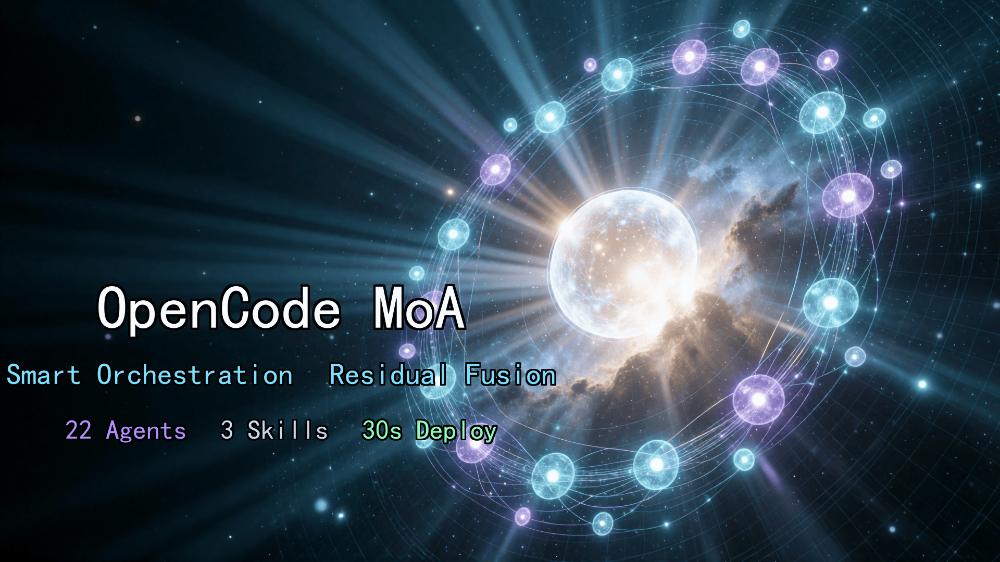
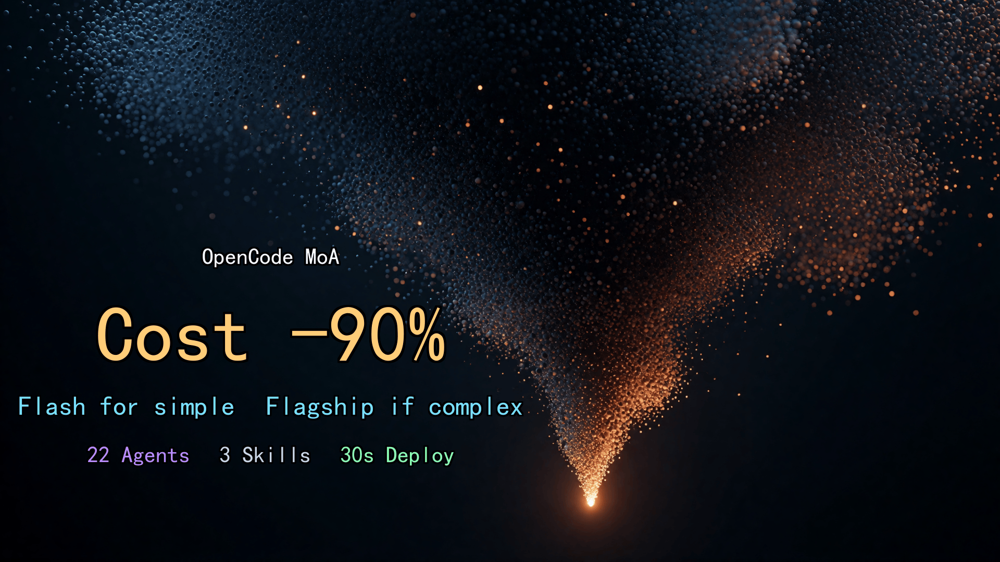

# OpenCode MoA

> 🌐 言語: 英語 · [中文](README.zh.md) · [日本語](README.ja.md) · [한국어](README.ko.md) · [Español](README.es.md) · [Français](README.fr.md) · [Deutsch](README.de.md)

[](LICENSE)
[](CONTRIBUTING.md)
[](https://opencode.ai)

> 🔥 **ホット (2026-07):** フラグシップファーストが **Kimi K3** にアップグレード — 2.8T パラメータ、1M コンテキスト、トップティアのフロンティアモデル。MoA の品質の上限は現在、パックの最前線にあります。

> 構造化出力、ライン受け入れ、アンチチート、自動ルーティング。詳細は [CHANGELOG](CHANGELOG.md) を参照してください。

> **1つの会話エントリーポイント、22の専門モデルが自動的にコラボレーション。単純なタスクは Flash（安価）を使用し、複雑なタスクはフラグシップ（高価）を呼び出します。単純なタスクが作業負荷の大部分を占め、フラグシップの呼び出しが最小限に抑えられると、コストは最大で約90%削減されます（全フラグシップと比較）。実際の節約はタスクのミックスに依存し、コードの品質は大幅に向上します。**

<!-- ARCH-IMG -->

<!-- /ARCH-IMG -->

OpenCode MoAは、OpenCodeのためのエージェントの混合構成パッケージです。複数のモデルが**同じ問題について同時に考える**ことを可能にし、単一のモデルでは到達できない出力品質に融合します。ツールを切り替えたり、コードを書いたり、APIのクォータを持ったりする必要はありません — 単にファイルをプロジェクトにドロップし、OpenCodeを再起動してください。

**22エージェント · 5コマンド · 3スキル · 30秒デプロイ**

---


## なぜこれが必要ですか？

デフォルトでは、OpenCodeは最初から最後まで単一のモデルを使用します。1文字を変更し、システムアーキテクチャを設計するのに同じプロンプト、同じ温度、同じコンテキストを使用します。労働の分担はありません。

**3つの問題:**

1. **コストが制御不能** — 単純なタスクも高価なモデルを使用し、月々の請求が高止まりする
2. **品質のボトルネック** — 単一のモデルは思考の方法が1つしかなく、盲点に簡単にハマる
3. **フォールトトレランスがない** — モデルが死ぬとフリーズし、フォールバックがない

**MoAの解決策:**

```

You: メッセージキューソリューションの設計を手伝ってください

    ┌─ flag-arch (Qwen3.7 Max)  ─── アーキテクトの視点からの計画
    ├─ flag-plan (DeepSeek V4 Flash    )  ─── 計画の視点からの計画
    ├─ flag-eng  (DeepSeek V4 Flash)  ─── 実装者の視点からの計画
    └─ flag-fuse (Kimi K3    )  ─── 各モデルの最良の部分を取り入れ、最適な解決策を提供
```

<!-- COST-IMG -->

<!-- /COST-IMG -->

3つの異なるモデルからの3つの独立した計画が自然に「コンセンサス + ダイバージェンス」の構造を形成します。フュージョンモデルはコンセンサスを特定し、それを保持し、彼らが異なる部分での最良のものを取り入れます — これは単一のモデルではできません。

---


## 前提条件

### 必須

| 要件               | チェックコマンド                  | メモ                                                                                                                                                                                                 |
| ------------------- | ------------------------------ | ----------------------------------------------------------------------------------------------------------------------------------------------------------------------------------------------------- |
| OpenCodeがインストール済み  | `opencode --version`           | **>= 1.3.4**（エージェントレベルの `reasoningEffort`/`hidden`/`task` サポート; `openai-compatible` プロバイダーが推論を透過的に渡し、`forceReasoning` は不要）、[インストール](https://opencode.ai/install) |
| OpenCode Goプラン    | opencode.aiコンソール            | [サブスクライブ](https://opencode.ai/auth)、初月$5、その後$10/月                                                                                                                                 |
| Gitがインストール済み       | `git --version`                | リポジトリをクローンするために使用                                                                                                                                                                                |
| OpenCode Go APIキー | opencode.aiコンソールで作成 | Zenコンソール（opencode.ai）で作成                                                                                                                                                              |

### オプション（インストールスクリプトで必要）

| 要件               | チェックコマンド    | メモ                                                                     |
| ------------------- | ---------------- | ------------------------------------------------------------------------- |
| PowerShell Core     | `pwsh --version` | install.ps1で必要、Windowsにバンドルされているか、`brew install powershell` でインストール |
| jq                  | `jq --version`   | install.shでJSONマージに必要、`apt install jq` / `brew install jq` |

> pwsh/jqがなくても大丈夫です — メソッド1（AI自動デプロイ）またはメソッド3（手動マージ）を使用できます。

### デスクトップ vs CLI

- **CLI**: すべてのメソッドがサポートされています
- **デスクトップ**: メソッド1（AI自動デプロイ）が最も便利です; メソッド2/3は最初にターミナル操作が必要です

> ⚠️ **システムレベルのキーのパスを間違えて配置するのは簡単です** — 下記の「デプロイ前に読む」で正しいスペルを確認してください。間違ったパスは、デプロイが成功したように見えてもすべてのエージェントが接続できなくなります。

> ⚠️ **デプロイ前に読む: キーパスを間違えないでください**
> プロバイダー + キーを**プロジェクトレベルの `opencode.json`**（デフォルト、自己完結型）または**システムレベル**の共有パスのいずれかに配置してください — **1つだけ**選択してください。
> システムレベルを使用する場合、正しいパスは次の通りです:
> 
> - Linux/macOS `~/.config/opencode/opencode.json`
> - Windows `%USERPROFILE%\.config\opencode\opencode.json` (**not** `%APPDATA%\opencode`)
>   間違ったシステムレベルのパスは「デプロイが成功したがすべてのエージェントが接続できない」ことにつながります。

---


## 30秒デプロイ

### メソッド1: AI自動デプロイ（推奨）

1. [`docs/opencode-moa.en.md`](https://github.com/ZenHG/opencode-moa/blob/master/docs/opencode-moa.en.md)をダウンロード
2. そのドキュメントをOpenCodeにアップロードし、送信:

> このマニュアルから22のエージェント、5つのコマンド、3つのスキルを現在のプロジェクトにデプロイします

3. AIがすべてのファイルを自動的に作成します。**完了したらOpenCodeを再起動してください。**

> 手動でファイルを作成する必要はありません。デプロイマニュアル自体がインストーラーです。

### メソッド2: ワンクリックインストールスクリプト（スクリプト版 · CLIフレンドリー）

```bash
# リポジトリをクローン
git clone https://github.com/ZenHG/opencode-moa.git

# プロジェクトディレクトリに入る
cd your-project

# リポジトリから .opencode ディレクトリと .moa 設定をコピー
cp -r ../opencode-moa/.opencode/ .
cp -r ../opencode-moa/.moa/ .

# インストールスクリプトを実行（設定を自動マージし、APIキーを保持）
# Windows:
pwsh ../opencode-moa/install.ps1
# Linux/macOS:
bash ../opencode-moa/install.sh
```

> インストールスクリプトは元の `opencode.json` を自動バックアップし、プロバイダーとAPIキーを保持しながらMoA設定のみをマージします。
> 

### 任意のモデルをカスタマイズ

MoAは**汎用テンプレート**です — 各エージェントのモデルは変更可能なIDです。各エージェントファイルは次のように始まります:

```yaml
model: opencode-go/<model-id>
```

モデルを入れ替えるには、`.opencode/agents/<agent>.md`のその1行を、アクセス可能な任意の`provider/model-id`に編集します（例: `opencode-go/kimi-k2.7-code`, `opencode-go/deepseek-v4-flash`）。再インストールは不要です。自由に組み合わせてください — テンプレートは何にも縛られません。

### メソッド3: 手動インストール

```bash
# 1. リポジトリをクローン
git clone https://github.com/ZenHG/opencode-moa.git

# 2. .opencode ディレクトリと .moa 設定をコピー
cp -r opencode-moa/.opencode/ your-project/
cp -r opencode-moa/.moa/ your-project/

# 3. opencode.jsonを手動でマージ（直接置き換えないでください！）
# opencode.jsonを開き、MoAのpermission.taskとagentセクションをマージします
# 既存のプロバイダーとモデル設定を保持してください
```

> ⚠️ **cat >>** を使用して追加しないでください — JSON形式が壊れます。**直接置き換えないでください** — APIキーを失います。
> 

### デプロイが成功したかどうかを確認する方法

1. OpenCodeを再起動した後、`Tab`を押してエージェントを循環させ（Windowsデスクトップクライアントでは `Ctrl+.` も機能します）、「门童」を確認します
2. `@工具人`と入力すると応答があります
3. 検証スクリプトを実行します: `pwsh .opencode/tests/T0-static-verify.ps1`（デプロイ中に手動ブロック5.5によって生成された）、期待される結果はすべてPASS（FAIL=0; システムレベルのキーがある場合、WARNもPASSとしてカウントされます）

### ワンクリックロールバック

```bash
rm -rf your-project/.opencode/
rm -rf your-project/.moa/
# 手動でopencode.jsonを復元します（インストールスクリプトが自動バックアップを作成します）
```

---

## 使い方

**何も学ばず — ただ話す。** コンシェルジュルーターは自動的にタスクの複雑さを判断し、対応するエージェントチェーンを派遣します。

| あなたの発言                           | コンシェルジュルーターの動作                                      | 使用されるエージェント                     |
| -------------------------------------- | -------------------------------------------------------------- | ----------------------------------------- |
| "この変数の名前を変更して"              | 簡単なタスクとして判断                                          | swift (Flash)                             |
| "ユーザー認証モジュールを書いて"        | ツール層が収集 → 3つの中間層並列 → 統合                        | tool-handler + mid-tier trio + fuse       |
| "マイクロサービスアーキテクチャを設計して" | ツール層が収集 → 3つのフラッグシップ並列 → 統合 → 実装 → QA   | full-chain 6 agents                       |
| "このスクリーンショットのUIを復元して"   | 3人のフロントエンド専門家が並列 → リードが最良を選択          | frontend quartet                          |
| スクリーンショット付きのメッセージ      | ビジョントランスレーターがテキストに変換 → 通常のルーティング  | vision-translator                         |
| エラーログ / 図 / 複雑なコンテンツ付きのメッセージ | ビジョントランスレーターがコンテンツを分解 → 通常のルーティング | vision-translator (フォールバック役)       |

**直接 `@` コール:**

```
@闪电侠 help me write a hello world
@工具人 search all TODOs in the project
@视觉翻译官 analyze this screenshot
```

**ワンクリックコマンド:**

| コマンド          | シナリオ                                       |
| ----------------- | ---------------------------------------------- |
| `/moa-quick`      | 簡単なタスク、翻訳、設定変更                   |
| `/moa-medium`     | 機能モジュール、バグ修正、単一ファイルのリファクタリング |
| `/moa-flagship`   | システムアーキテクチャ、大規模リファクタリング   |
| `/moa-frontend`   | UI復元、CSS、スクリーンショット修正             |
| `/moa-describe`   | スクリーンショット/画像をテキストに変換        |

### 自動ルーティング

コンシェルジュルーターはキーワード分析に基づいてタスクタイプを自動検出します:

- **探索タスク**: "分析する", "比較する", "理解する", "調査する" → 探索プロンプト + 探索型の受け入れ仕様
- **実行タスク**: "修正する", "追加する", "実装する", "デプロイする" → 実行プロンプト + ストップロスルール
- **タスクタイプ（`taskType=explore|execute`）は门童メタデータとして統合層にインライン化され、統合層がタイプに応じた受け入れ仕様を生成します**

---

## アーキテクチャ

```
                      concierge-router (Flash)
                                 │
                ┌────────────────┼─────────────────┐
                ▼                ▼                 ▼
             ツール層         意見層             融合層
             Flash + MiMo + Qwen3.7 Plus   3つの並列意見が最良を選択
             (~80% コール)   (~18% コール)        (~2% コール)
```

**ツール層** (Flash + MiMo + Qwen3.7 Plus) — コードを読み、ファイルを検索し、スクリーンショットをテキストに変換します。安価で迅速、自由に呼び出せます。

**意見層** (Qwen / Kimi / Flash) — 異なる視点からの計画。3つの意見が自然に「合意 + 分岐」の構造を形成します。

**融合層** (Kimi K3 / Kimi K2.7 / Flash lead / DeepSeek V4 Pro フォールバック) — 合意を維持し、分岐の中で最良を選択し、融合が失敗した場合はDeepSeek V4 Proにフォールバックします。フラッグシップの融合は現在 **Kimi K3** (2.8T パラメータ, 1M コンテキスト, トップティアのフロンティアモデル) で動作しており、MoAの品質の上限を引き上げています。

> ⚠️ 以下のコールボリューム比率 (~80% / ~18% / ~2%) は **設計目標** であり、測定された統計ではありません。実際の比率はタスクの複雑さによって異なります。

### 構造化出力

意見および融合エージェントは `---section-name---` マーカーを使用します。意見層: `---記憶層---` + `---方案---` + `---红线---`。融合層: `---融合方案---` + `---分歧裁决---` + `---白名单---` + `---红线---` + `---验收标准---`。下流の解析とライン検証を可能にします。

### アンチチート

実装エージェントが手を抜くのを防ぎます: ベースラインの非回帰、禁止行動（テストのスキップ/モック/削除）、隠れたスポットチェック、実装の差分チェック、ストップロス（アイテムごとに3回のリトライ、回帰時のロールバック）。受け入れ基準テンプレートは `.moa/界线.json` にあります。

## 22 エージェント

> 英語名は論理的役割であり、中国語（括弧内）は `.opencode/agents/` 下の **正確なファイル名** です — `@` で呼び出します（例: `@门童`）。

```
concierge-router (门童, Flash)
 │
 ├── ツール層 ─────────────────────────────────────────────
 │   tool-handler      (工具人, Flash    ) コードを読み、ファイルを検索
 │   tool-handler-mimo (工具人-mimo, MiMo) [hidden]  信頼性のあるファイル読み取り（フォールバック + 並列）
 │   swift             (闪电侠, Flash    ) 簡単なタスクを一発で
 │   vision-translator (视觉翻译官, Qwen3.7 Plus ) スクリーンショット/UI→テキスト; ログ/図/文書→分解
 │
 ├── 残差抽出者  (残差提取者,  Flash     ) 計画間の分岐を分析
 ├── 信頼度評価者 (置信度评估者, GPT 5.6 Luna    ) 融合結果の信頼度を評価
 │
 ├── 中間意見層 ─────────────────────────────────────────────
 │   mid-eng      (中级·工程, Kimi K2.6 ) エンジニアリングの視点
 │   mid-creative (中级·创意, Qwen3.7 Plus) 創造的な視点
 │   mid-coder    (中级·码农, Flash     ) 実務的な視点
 │   mid-fuse     (中级·融合, Kimi K2.7 Code) 3つの計画を融合 [max_tokens: 16384]
 │
 ├── フラッグシップ意見層 ─────────────────────────────────────────────
 │   flag-arch (旗舰·架构, Qwen3.7 Max ) トップレベルのアーキテクチャ
 │   flag-plan (旗舰·规划, DeepSeek V4 Flash     ) 構造化計画
 │   flag-eng  (旗舰·工程, DeepSeek V4 Flash  ) 大規模な実装
 │   flag-fuse (旗舰·融合, Kimi K3     ) 3つのアーキテクチャ計画を融合 [max_tokens: 16384]
 │   flag-impl (旗舰·执行, Flash) [hidden]  融合された計画に従って実装
 │   flag-qa   (旗舰·质检, DeepSeek Pro) 計画レビュー + コード受け入れ [max_tokens: 16384]
 │
 └── フロントエンド意見層 ─────────────────────────────────────────────
     fe-restore (前端·还原, Qwen3.7 Plus       ) ピクセルパーフェクトなUI復元
     fe-logic   (前端·逻辑, Qwen3.7 Plus) コンポーネントアーキテクチャ & 状態管理
     fe-motion  (前端·动效, MiMo-Pro   ) インタラクション & モーション
     fe-lead    (前端·总工, DeepSeek V4 Flash    ) 3つのフロントエンド計画の中から最良を選択 [max_tokens: 16384]
```

フォールバックエージェント（上記のルーターチェーンには含まれず、融合が失敗したときのみ呼び出されます）：

```
fallback (融合·保底, DeepSeek V4 Pro) — 同じ残差強化融合、flag-fuse / mid-fuse / fe-lead が失敗した場合に使用

## フォールトトレランス設計


---
## 検証
```bash
# Layer 0 — 静的チェック (自動, 0 トークン)
pwsh .opencode/tests/T0-static-verify.ps1
# 3 つのレイヤーを一度に実行
pwsh .opencode/tests/run-all.ps1
```

`.opencode/tests/` に チェックスクリプト: Layer 0 は自動（T0 静的 / T1 README 整合性 / T3 権限セキュリティ）、Layer 1–2 は OpenCode 内での手動ガイド付きチェックリストです。詳細：[検証](docs/README-details.md#verification)。

---

## ドキュメント

| ドキュメント | 内容 |
| ---- | ---- |
| [docs/README-details.md](docs/README-details.md) | フォールトトレランス設計 · コスト · セキュリティ · 検証 · FAQ |
| [docs/opencode-moa.md](docs/opencode-moa.md) | 完全なデプロイマニュアル — AI 自動デプロイのインストーラー本体 |

---
## 貢献

PR と Issues を歓迎します。 [CONTRIBUTING.md](CONTRIBUTING.md) を参照してください。

---


## ライセンス

[MIT](LICENSE) · [OpenCode MoA](https://github.com/ZenHG/opencode-moa)

