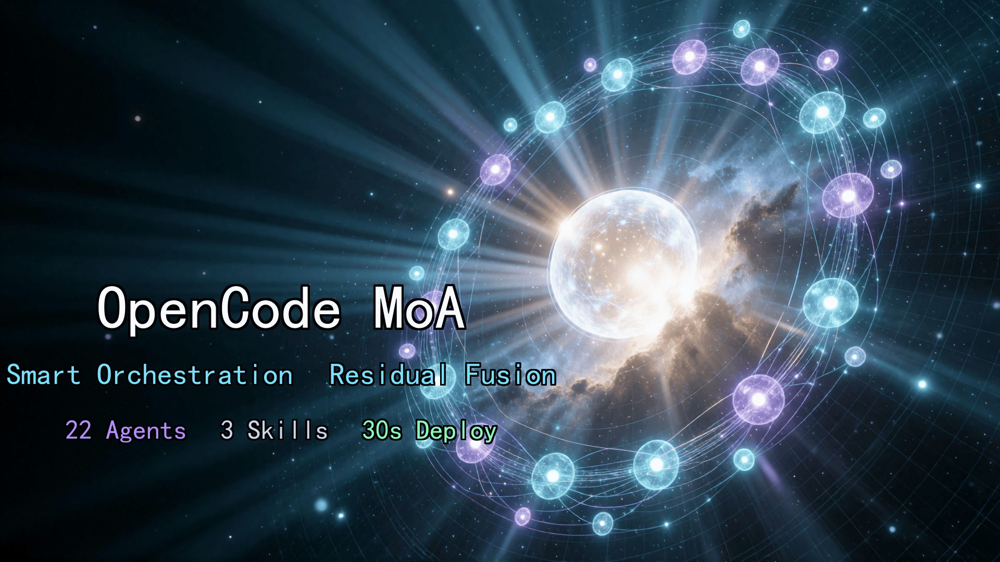

# OpenCode MoA

> 🌐 Languages: [English](README.md) · [中文](README.zh.md) · [日本語](README.ja.md) · 한국어 · [Español](README.es.md) · [Français](README.fr.md) · [Deutsch](README.de.md)

[](LICENSE)
[](CONTRIBUTING.md)
[](https://opencode.ai)

> 🔥 **새소식 (2026-07):** 프래그십 퓨전을 **Kimi K3** 로 업그레이드 — 2.8T 파라미터, 1M 컨텍스트, 최상위 frontier 모델. OpenCode Go 할당량 7/24 까지 2배 (140 → 280 / 5h, 이후 140으로 복귀).

> **하나의 대화 진입점에서 22개의 전문 모델이 자동으로 협업합니다. 간단한 작업은 Flash(저렴), 복잡한 작업만 flagship(비쌈)을 호출합니다. 비용은 최대 약 90% 절감(모두 flagship 사용 대비), 코드 품질은 크게 향상됩니다. 단순 작업이 주를 이루고 flagship 호출이 최소화될 때, 실제 절감은 작업 구성에 따라 다릅니다.**

<!-- ARCH-IMG -->

<!-- /ARCH-IMG -->

OpenCode MoA는 OpenCode용 Mixture of Agents 구성 패키지입니다. 여러 모델이 **같은 문제를 동시에 생각**한 뒤, 단일 모델로는 도달하기 어려운 품질의 결과로 융합합니다. 도구를 바꾸거나, 코드를 작성하거나, API quota를 준비할 필요가 없습니다. 파일을 프로젝트에 넣고 OpenCode를 재시작하면 됩니다.

**22 agents · 5 commands · 3 skills · 30초 배포**

---

## 왜 필요할까요?

기본 OpenCode는 처음부터 끝까지 단일 모델을 사용합니다. 한 글자를 바꾸는 작업과 시스템 아키텍처를 설계하는 작업이 같은 prompt, 같은 temperature, 같은 context를 사용합니다. 역할 분담이 없습니다.

**세 가지 문제:**

1. **비용 통제 어려움** — 간단한 작업에도 비싼 모델을 사용해 월 비용이 높아짐
2. **품질 병목** — 단일 모델은 하나의 사고 방식만 가지며 blind spot에 빠지기 쉬움
3. **장애 허용성 없음** — 모델이 실패하면 멈추고 fallback이 없음

**MoA의 해결책:**

```text
You: help me design a message queue solution

    ┌─ flag-arch (Qwen3.7 Max)     ─── architect 관점의 계획
    ├─ flag-plan (GLM 5.2        ) ─── PM 관점의 계획
    ├─ flag-eng  (MiniMax M3 )     ─── implementer 관점의 계획
    └─ flag-fuse (Kimi K3)         ─── 각 장점을 융합해 하나의 최적안 생성

```

<!-- COST-IMG -->

<!-- /COST-IMG -->

서로 다른 세 모델의 독립 계획은 자연스럽게 “consensus + divergence” 구조를 만듭니다. fusion model은 consensus를 보존하고 divergence에서는 가장 좋은 부분을 선택합니다. 이는 단일 모델로는 어렵습니다.

---

## 사전 요구사항

### 필수

| Requirement | Check command | Notes |
| --- | --- | --- |
| OpenCode installed | `opencode --version` | **>= 1.3.4** (agent-level `reasoningEffort`/`hidden`/`task` support; `openai-compatible` provider transparently passes reasoning, no `forceReasoning` needed), [install](https://opencode.ai/install) |
| OpenCode Go plan | opencode.ai console | [Subscribe](https://opencode.ai/auth), first month $5, then $10/month |
| Git installed | `git --version` | repo clone에 사용 |
| OpenCode Go API Key | opencode.ai console에서 생성 | Zen console(opencode.ai)에서 생성 |

### 선택 사항(install scripts에 필요)

| Requirement | Check command | Notes |
| --- | --- | --- |
| PowerShell Core | `pwsh --version` | install.ps1에 필요, Windows 포함 또는 `brew install powershell` |
| jq | `jq --version` | install.sh JSON merge에 필요, `apt install jq` / `brew install jq` |

> pwsh/jq가 없어도 괜찮습니다. Method 1(AI auto-deploy) 또는 Method 3(manual merge)을 사용할 수 있습니다.

### Desktop vs CLI

- **CLI**: 모든 방법 지원
- **Desktop**: Method 1(AI auto-deploy)이 가장 편리하며, Methods 2/3은 먼저 terminal 작업이 필요합니다

> ⚠️ **system-level key path는 틀리기 쉽습니다** — 아래 “배포 전 읽기”의 정확한 철자를 확인하세요. 잘못된 경로는 “deployment succeeds but all agents can't connect”로 이어집니다.

> ⚠️ **배포 전 읽기: key path를 잘못 두지 마세요**
> provider + key는 **project-level `opencode.json`**(기본, self-contained) 또는 **system-level** shared path 중 하나에만 둡니다.
> system-level을 쓰는 경우 올바른 경로는:
>
> - Linux/macOS `~/.config/opencode/opencode.json`
> - Windows `%USERPROFILE%\.config\opencode\opencode.json` (**`%APPDATA%\opencode`가 아님**)
>   잘못된 system-level path는 “deployment succeeds but all agents can't connect”를 유발합니다.

---

## 30초 배포

### Method 1: AI auto-deploy(권장)

1. [`docs/opencode-moa.en.md`](https://github.com/ZenHG/opencode-moa/blob/master/docs/opencode-moa.en.md) 다운로드
2. OpenCode에 해당 문서를 업로드하고 전송:

> Deploy all 22 agents, 5 commands, and 3 skills from this manual into the current project

3. AI가 모든 파일을 자동 생성합니다. 완료 후 **OpenCode를 재시작**하세요.

> 파일을 수동으로 만들 필요가 없습니다. 배포 매뉴얼 자체가 installer입니다.

### Method 2: one-click install script(script version · CLI-friendly)

```bash
# clone the repo
git clone https://github.com/ZenHG/opencode-moa.git

# enter your project directory
cd your-project

# copy the .opencode directory from the repo
cp -r ../opencode-moa/.opencode/ .

# run the install script (auto-merge config, keeps your API key)
# Windows:
pwsh ../opencode-moa/install.ps1
# Linux/macOS:
bash ../opencode-moa/install.sh
```

> install script는 기존 `opencode.json`을 자동 백업하고, provider와 API key는 유지한 채 MoA config만 merge합니다.
>
> Note: 이 방법은 repo에 포함된 `.opencode/`를 그대로 복사합니다. agents는 **중국어 표시 이름**을 사용합니다. 영어 이름 agents(`@english-name`)를 원하면 Method 1을 사용하세요.

### Method 3: manual install

```bash
# 1. clone the repo
git clone https://github.com/ZenHG/opencode-moa.git

# 2. copy the .opencode directory
cp -r opencode-moa/.opencode/ your-project/

# 3. manually merge opencode.json (do NOT replace directly!)
# open opencode.json, merge MoA's permission.task and agent sections in
# keep your existing provider and model config
```

> ⚠️ `cat >>`로 append하지 마세요. JSON format이 깨집니다. 직접 교체하지 마세요. API key를 잃습니다.
>
> Note: 이 방법은 repo에 포함된 `.opencode/`를 그대로 복사합니다. agents는 **중국어 표시 이름**을 사용합니다. 영어 이름 agents(`@english-name`)를 원하면 Method 1을 사용하세요.

### 배포 성공 확인

1. OpenCode 재시작 후 `Tab`으로 agents를 순환(Windows desktop client: `Ctrl+.`도 가능)하여 “concierge-router” 확인
2. `@tool-handler`를 입력했을 때 응답 확인
3. verification script 실행: `pwsh .opencode/tests/T0-static-verify.ps1`(deploy 중 manual Block 5.5에서 생성), expected all PASS(FAIL=0; system-level key에서는 WARN도 pass)

### one-click rollback

```bash
rm -rf your-project/.opencode/
# manually restore your opencode.json (the install script auto-backs up a .bak file)
```

---

## 사용 방법

**배울 필요 없이 그냥 말하세요.** concierge-router가 task complexity를 자동 판단해 적절한 agent chain으로 dispatch합니다.

| What you say | What the concierge-router does | Agents used |
| --- | --- | --- |
| "rename this variable" | simple task로 판단 | swift (Flash) |
| "write a user auth module" | tool layer gathers → 3 mid-tier parallel → fuse | tool-handler + mid-tier trio + fuse |
| "design a microservice architecture" | tool layer gathers → 3 flagship parallel → fuse → implement → QA | full-chain 6 agents |
| "restore this screenshot's UI" | 3 frontend experts parallel → lead picks best | frontend quartet |
| screenshot 포함 message | vision-translator가 text로 변환 → normal routing | vision-translator |

**직접 `@` 호출:**

```text
@swift help me write a hello world
@tool-handler search all TODOs in the project
@flag-arch design a message queue solution
```

**one-click commands:**

| Command | Scenario |
| --- | --- |
| `/moa-quick` | simple task, translation, config change |
| `/moa-medium` | function module, bug fix, single-file refactor |
| `/moa-flagship` | system architecture, large refactor |
| `/moa-frontend` | UI restore, CSS, screenshot fix |
| `/moa-describe` | screenshot/image to text |

---

## 아키텍처

```text
                      concierge-router (Flash)
                                 │
                ┌────────────────┼─────────────────┐
                ▼                ▼                 ▼
             Tool layer     Opinion layer       Fusion layer
             Flash + MiMo   3 parallel opinions take the best
             (~80% calls)   (~18% calls)        (~2% calls)
```

**Tool layer**(Flash + MiMo) — code read, file search, screenshot to text. 저렴하고 빠르며 자유롭게 호출할 수 있습니다.

**Opinion layer**(MiniMax / DeepSeek Pro / Qwen / MiMo-Pro) — 다양한 관점에서 plan을 만듭니다. 세 의견은 자연스럽게 “consensus + divergence” 구조를 형성합니다.

**Fusion layer**(Kimi / Qwen-Max / GLM / DeepSeek Pro fallback) — consensus는 유지하고 divergence에서는 최선을 선택하며, fusion 실패 시 DeepSeek V4 Pro로 fallback합니다.

> ⚠️ 아래 call-volume ratios(~80% / ~18% / ~2%)는 **design targets**이며 measured statistics가 아닙니다. 실제 비율은 task complexity에 따라 달라집니다.

---

## 22 Agents

```text
concierge-router (门童路由员, Flash)
 │
 ├── Tool layer ─────────────────────────────────────────────
 │   tool-handler      (工具人,      Flash ) read code, search files [+ material self-check]
 │   tool-handler-mimo (工具人-mimo, MiMo  ) reliable file read (fallback + parallel) [hidden]
 │   swift             (闪电侠,      Flash ) simple tasks in one shot
 │   vision-translator (视觉翻译官,  MiMo  ) screenshot/UI/error image to text
 │
 ├── residual-extractor  (残差提取者,  Flash     ) analyze divergence between plans
 ├── confidence-assessor (置信度评估者, DS Pro    ) assess fusion result confidence
 │
 ├── Mid-tier opinion layer ─────────────────────────────────────────────
 │   mid-eng      (中级·工程, Kimi K2.6   ) engineering view
 │   mid-creative (中级·创意, Qwen3.7 Plus) creative view
 │   mid-coder    (中级·码农, Flash       ) pragmatic view
 │   mid-fuse     (中级·融合, Kimi        ) fuse three plans [max_tokens: 16384]
 │
 ├── Flagship opinion layer ─────────────────────────────────────────────
 │   flag-arch (旗舰·架构, Qwen3.7 Max ) top-level architecture
 │   flag-plan (旗舰·规划, GLM 5.2   ) structured planning
 │   flag-eng  (旗舰·工程, MiniMax M3  ) large-scale implementation
 │   flag-fuse (旗舰·融合, Kimi K3     ) fuse three architecture plans [max_tokens: 16384]
 │   flag-impl (旗舰·实现, Flash       ) implement per fused plan [hidden]
 │   flag-qa   (旗舰·质检, DeepSeek Pro) plan review + code acceptance [max_tokens: 16384]
 │
 └── Frontend opinion layer ─────────────────────────────────────────────
     fe-restore (前端·还原, MiMo        ) pixel-perfect UI restore
     fe-logic   (前端·逻辑, Qwen3.7 Plus) component architecture & state mgmt
     fe-motion  (前端·动效, MiMo-Pro     ) interaction & motion
     fe-lead    (前端·总工, GLM-5.2      ) pick best of three frontend plans [max_tokens: 16384]
 ```

Fallback agent (not in the router chain above, called only when fusion fails):
```text
fallback (融合·保底, DeepSeek V4 Pro) — same residual-enhanced fusion, used when flag-fuse / mid-fuse / fe-lead fail
 ```

---

## 장애 허용 설계

### Tool layer fallback 체인

Tool layer가 실패해도 멈추지 않습니다. 자동 downgrade합니다:

```text
tool-handler (Flash) failed → immediate retry once
  → retry succeeds → return normally
  → retry fails → tool-handler-mimo (MiMo) failed → immediate retry once
    → retry succeeds → return normally
    → retry fails → ask user:
      A. wait a few minutes and retry
      B. skip tool layer, call opinion layer directly (higher cost)
      C. switch to free model
```

> 대부분의 provider errors(502/503/timeout)는 일시적이며, 빠른 retry로 보통 성공합니다.

### Fusion layer fallback

primary fusion agent가 실패(STUCK / ERROR_PROVIDER / timeout / empty result)하면 concierge-router는 자동으로 `@融合·保底`(DeepSeek V4 Pro)로 fallback합니다:

```text
flag-fuse (旗舰·融合, Kimi K3) failed
  → task(@融合·保底) (DeepSeek V4 Pro) → output fallback result
mid-fuse (中级·融合, Kimi) failed
  → task(@融合·保底) (DeepSeek V4 Pro) → output fallback result
fe-lead (前端·总工, GLM-5.2) failed
  → task(@融合·保底) (DeepSeek V4 Pro) → output fallback result
```

fallback agent는 동일한 residual-enhanced fusion process를 사용합니다.

### MCP 권한 격리

Opinion-layer agents는 code를 직접 읽는 것이 금지됩니다(`read: deny` + `bash: deny`). tool layer를 우회해 자료를 가져오는 것을 막습니다:

- Tool layer: code read, file search 가능(`read`/`bash` access)
- Opinion layer: `read: deny` + `bash: deny`, tool layer가 제공한 material에만 기반해 plan
- Fusion layer: 동일한 제한, 세 opinions만 기반으로 fuse

> Note: 이 project는 MCP servers를 설정하지 않습니다. 여기서 “MCP permission isolation”은 MCP server-level isolation이 아니라 agent-level tool restrictions(`read: deny` / `bash: deny`)를 의미합니다.

### 자료 없음 fallback

Opinion layer가 호출되었지만 material이 없을 때(tool layer 완전 실패) 사용자에게 묻습니다:

- “give plan directly” 선택 → requirement description 기반의 순수 logical reasoning(code read 없음)
- “wait for tool layer” 선택 → WAITING 출력, tool layer 회복 후 retry

### 오류 분류

Tool layer는 실패 시 명확한 error category를 출력하고, 무작정 retry하지 않습니다:

- `ERROR_PROVIDER` — server 502/503/timeout
- `ERROR_AUTH` — auth failure
- `ERROR_UNKNOWN` — other errors

---

## 비용

### 왜 약 90% 절감되는가

MoA는 call-volume-weighted mix로 비용을 계산합니다: 약 80% tool-layer Flash, 18% mid-tier, 2% flagship. 아래 cost table의 per-unit prices로 effective output unit price를 추정합니다:

> **Important**: 80/18/2 ratios는 architecture가 설계한 **expected call volume distribution**이며 measured cost proportions가 아닙니다. 실제 사용량은 task types와 complexity에 따라 달라집니다.

| Layer      | Share | Output unit price /1M                                                                                | Weighted |
| ---------- | ----- | ---------------------------------------------------------------------------------------------------- | -------- |
| Tool layer | 80%   | $0.28                                                                                                | $0.224   |
| Mid tier   | 18%   | ~$2.10 (MiniMax $1.20 / DeepSeek Pro $3.48 / Qwen Plus $1.60 / Kimi K2.7 $4.00 mid-fuse avg)       | $0.378   |
| Flagship   | 2%    | ~$6.00 (Qwen/GLM/MiniMax ~$4-7 + Kimi K3 $15.00 flag-fuse)                                         | $0.12    |

혼합 유효 출력 단가는 ≈ **$0.72 / 1M**입니다. “all-flagship GLM $7.50” 대비 약 10% → **약 90% 절감**; “all-mid-tier DeepSeek Pro $3.48” 대비 약 21% → **약 79% 절감**. “save 90%”는 flagship baseline에 대한 실제 가치입니다.

### OpenCode Go 플랜

MoA는 [OpenCode Go](https://opencode.ai/docs/zh-cn/go/) plan 기반이며, **첫 달 $5, 이후 $10/month**입니다.

**Usage limits:**

| Time window | Quota |
| --- | --- |
| Every 5 hours | $12 |
| Weekly | $30 |
| Monthly | $60 |

Limits는 dollar value로 정의됩니다. 저렴한 models(Flash)는 더 자주, 비싼 models(GLM)는 덜 자주 사용할 수 있습니다.

### 레이어별 월간 quota

| Layer      | Model           | Unit price (in/out per 1M) | Monthly quota | Call frequency      |
| ---------- | --------------- | -------------------------- | ------------- | ------------------- |
| Tool layer | Flash           | $0.14 / $0.28              | 158,150       | ~80%                |
| Tool layer | MiMo-V2.5       | $0.14 / $0.28              | 150,400       | (use freely)        |
| Opinion    | MiniMax M3      | $0.30 / $1.20              | 16,000        | ~18%                |
| Opinion    | DeepSeek V4 Pro | $1.74 / $3.48              | 17,150        |                     |
| Opinion    | Qwen3.7 Plus    | $0.40 / $1.60              | 21,600        |                     |
| Fusion     | Kimi K2.7 Code  | $0.95 / $4.00              | 9,250         | ~2% (mid-tier fuse) |
| Fusion     | Kimi K3         | $3.00 / $15.00             | 280           | ~2% (flagship fuse) |
| Fusion     | GLM-5.2         | $1.40 / $4.40              | 4,300         | ~2% (frontend lead) |

> 모든 model IDs는 선언 예시입니다. 선호하는 model로 교체할 수 있습니다.


### 한도 도달 후

- **Free model fallback** — Go limit 도달 후에도 free models를 계속 사용할 수 있습니다
- **Zen balance fallback** — console에서 “use balance”를 활성화하면 Go limit 후 Zen balance를 자동 사용합니다

### 무료 모델

OpenCode Zen은 마지막 fallback으로 free models를 제공합니다:

| Model | Trait |
| --- | --- |
| DeepSeek V4 Flash Free | fast, but limited context |
| MiMo-V2.5 Free | better quality, but may be slow |
| North Mini Code Free | provided by Cohere |
| Nemotron 3 Ultra Free | NVIDIA free endpoint |

> ⚠️ Free model limits: context window가 더 작고, 응답이 느릴 수 있으며, data가 training에 사용될 수 있고, 기간 한정 무료입니다.

---

## 보안

| Protection | Effect |
| --- | --- |
| Global catch-all | undeclared tool call → popup confirm |
| Agent permission isolation | each agent can only use allowed tools |
| MCP permission isolation | opinion layer forbidden from reading code (`read: deny` / `bash: deny`), prevents bypassing tool layer (project has no MCP server configured; “MCP” here refers to agent-level tool restrictions) |
| Task whitelist | concierge-router can only call declared agents |
| Fallback chain | tool layer fails → ask user → wait/skip/free model |
| One-click rollback | delete `.opencode/` to restore |

---

## 로컬 모델

Ollama / LM Studio 같은 local models를 혼합해 사용할 수 있습니다:

```yaml
# .opencode/agents/mid-coder.md
model: ollama-local/qwen3-coder
```

[`docs/opencode-moa.md`](docs/opencode-moa.md)의 Appendix A를 참고하세요.

---

## 검증

Deploy 후 static check를 실행하세요(`pwsh` 필요):

```bash
pwsh .opencode/tests/T0-static-verify.ps1
# expected: all PASS / FAIL=0 (with system-level key, WARN also counts as pass)
```

---

## FAQ

### Installation

**Q: 이미 opencode.json이 있습니다. 덮어쓰나요?**
A: 아니요. install script는 MoA의 `permission`, `agent`, `default_agent` config만 merge하고 기존 `provider`, `model` 등을 유지합니다. 원본 파일은 `.bak.timestamp`로 자동 backup됩니다.

**Q: Windows에 `cp` command가 없으면 어떻게 하나요?**
A: `Copy-Item` 또는 `xcopy`를 사용하세요:

```powershell
# PowerShell
Copy-Item -Recurse -Force opencode-moa\.opencode .\.opencode
# CMD
xcopy opencode-moa\.opencode .\.opencode /E /I /Y
```

**Q: pwsh/jq 없이 install할 수 있나요?**
A: 네. Method 1(AI auto-deploy) 또는 Method 3(manual config merge)을 사용하세요.

**Q: desktop app에서는 어떻게 install하나요?**
A: Method 1이 가장 편리합니다. `docs/opencode-moa.en.md`를 chat box에 drag하고 AI auto-deploy를 실행하세요. Methods 2/3은 먼저 terminal(CMD/PowerShell/Terminal) 작업이 필요합니다.

### Usage

**Q: “concierge-router”가 보이지 않습니다.**
A: “30-second deploy → How to tell deployment succeeded”의 세 가지 확인을 참고하세요: project root의 `opencode.json`, `.opencode/agents/` 아래 22개 `.md`, restart 후 `Tab` 전환(Windows desktop client: `Ctrl+.`도 가능).

**Q: `@tool-handler`가 응답하지 않습니다.**
A: `.opencode/agents/tool-handler.md`가 존재하고 frontmatter format이 올바른지 확인하세요.

**Q: Error “model not found”?**
A: Model ID format은 `provider/model-id`입니다(예: `opencode-go/kimi-k2.7-code`). config file(system-level `~/.config/opencode/opencode.json` 또는 project `opencode.json`)에 provider를 등록한 뒤 TUI에서 `/models`로 available models를 확인하세요.

**Q: 원래 build/plan agent로 돌아가려면?**
A: `Tab`으로 전환(Windows desktop client: `Ctrl+.`도 가능)하거나 `/build`, `/plan`을 입력하세요. MoA는 built-in agents에 영향을 주지 않습니다.

**Q: Go plan이 아니라 내 model을 쓰고 싶습니다.**
A: agent의 `model` field를 바꾸면 됩니다:

```yaml
# .opencode/agents/mid-eng.md
model: opencode-go/glm-5.2
```

**Q: deploy 후 repo를 삭제해도 되나요?**
A: 네. MoA는 이미 project의 `.opencode/` directory로 복사되었으므로 원본 repo는 삭제해도 됩니다.

**Q: 여러 projects에 deploy하려면?**
A: project마다 별도로 deploy하세요. `.opencode/`는 project-level config이며 다른 projects에 영향을 주지 않습니다.

### Fallback

**Q: tool layer 전체가 down되면 어떻게 하나요?**
A: 위 “Fault tolerance design → Fallback chain”을 참고하세요. MoA는 사용자에게 A. 몇 분 기다림 / B. tool layer를 skip하고 opinion layer 직접 호출(higher cost)을 선택하도록 ask합니다.

**Q: free models는 어디에 있나요?**
A: 위 “Cost → Free models”를 참고하세요. `/models`로 model list를 열고 “Free” tag가 붙은 model을 선택하세요(Windows desktop client: `Ctrl+'`도 가능)(DeepSeek V4 Flash Free, MiMo-V2.5 Free, North Mini Code Free 등). Free models는 context가 제한되고, 느릴 수 있으며, data가 training에 사용될 수 있습니다.

---

## 검증

리포지토리에는 `.opencode/tests/` 아래 세 가지 점검 스크립트가 포함되어 있습니다. Layer 0은 완전 자동, Layer 1–2는 OpenCode 내에서 단계별로 확인하는 수동 가이드입니다.

```bash
# Layer 0 — 정적 점검 (자동, 0 token)
pwsh .opencode/tests/T0-static-verify.ps1
# expected: all PASS / FAIL=0 (with system-level key, WARN also counts as pass)

# 세 레이어를 한 번에 실행
pwsh .opencode/tests/run-all.ps1
```

| Script                    | Layer | 역할                                                                                     | 모드                 |
| ------------------------- | ----- | ---------------------------------------------------------------------------------------- | -------------------- |
| `T0-static-verify.ps1`    | 0     | 파일 구조, agent/command/skill 개수, README 앵커, key 경로 정확성 점검                       | 자동                 |
| `T1-behavioral-guide.ps1` | 1     | routing / opinion / fusion 동작 확인 체크리스트 출력                                       | 수동 (OpenCode 내)   |
| `T2-moa-smoke-guide.ps1`  | 2     | `/moa-*` 명령 end-to-end 스모크 테스트 체크리스트 출력                                     | 수동 (OpenCode 내)   |
| `run-all.ps1`             | 0–2   | T0 실행 후 T1/T2 가이드 체크리스트 출력                                                   | 혼합                 |

---

## 유지자 도구 (최종 사용자 불필요)

다음 파일은 **리포지토리 유지자**용이며 MoA 배포용이 아닙니다. 최종 사용자는 무시해도 됩니다.

| 파일                       | 용도                                                                                                   |
| -------------------------- | ------------------------------------------------------------------------------------------------------ |
| `deploy-sync.ps1`          | 유지자 전용 — 리포지토리를 GitHub에 동기화하고 `opencode-moa` skill을 SkillHub에 업로드. `-SkipGit` / `-SkipSkillHub` / `-DryRun` 지원. |
| `scripts/hooks/pre-commit` | 로컬 git 훅 알림: `CHANGELOG.md` 변경을 스테이징할 때 경고 (master push 시 자동 릴리스).                  |
| `scripts/hooks/pre-push`   | 로컬 git 훅 알림: `CHANGELOG.md` 변경을 master에 push하기 전 버전 확인; 비대화형/CI 환경에서는 자동 진행.  |

> 이 훅들은 자동으로 설치되지 않습니다. 알림을 원하면 `.git/hooks/`에 심링크하세요.

---

## 기여

PR과 Issues를 환영합니다. [CONTRIBUTING.md](CONTRIBUTING.md)를 참고하세요.

---

## 라이선스

[MIT](LICENSE) · [OpenCode MoA](https://github.com/ZenHG/opencode-moa)
