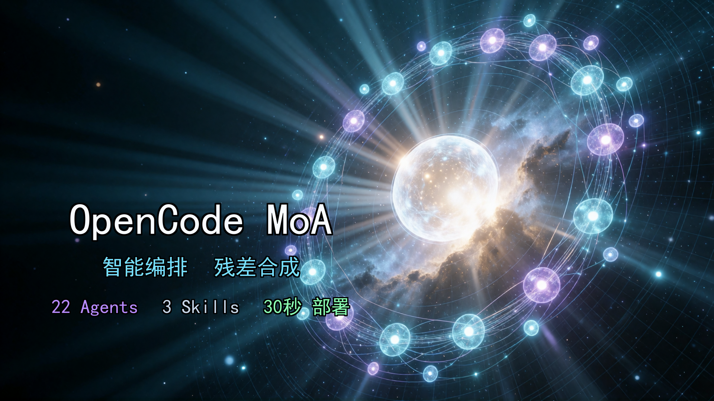
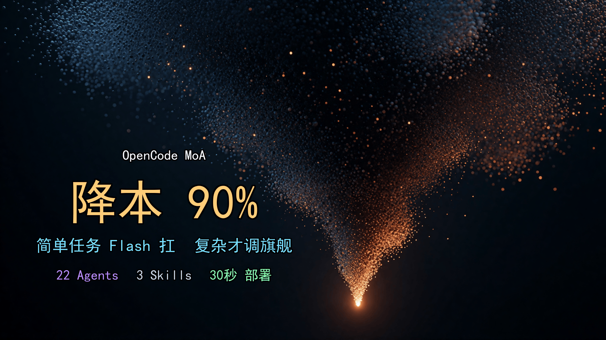

# OpenCode MoA

> 🌐 语言 / Languages: [English](README.md) · 中文 · [日本語](README.ja.md) · [한국어](README.ko.md) · [Español](README.es.md) · [Français](README.fr.md) · [Deutsch](README.de.md)

[](LICENSE)
[](CONTRIBUTING.md)
[](https://opencode.ai)

> 🔥 **热点（2026-07）：** 旗舰融合已升级至 **Kimi K3** —— 2.8T 参数、1M 上下文、顶级前沿模型。MoA 质量天花板现已站在第一梯队最前。

> 🔥 **热点（2026-07）：** **DeepSeek-V4-Flash-0731** 正式版发布 —— agentic 能力大幅增强，在 agent 基准上反超更贵的 **GLM-5.2**（Terminal Bench 82.7 vs 81.0、DeepSWE 54.4 vs 46.2、Toolathlon 70.3 vs 59.9）。便宜打败贵——MoA 工具层与意见层的 Flash 主力，同价能力再上台阶。

> 🔄 **长程自完善（LongLoop，24h 无人值守）：** 让你的项目连续多天自动迭代 —— 不遗忘、不停止、不重复。门童每轮唤醒、走完整 MoA 流水线、进度落盘。一条命令跑在你的项目上：**[▶ 立即开始 →](longloop/docs/长程自完善.md)**

> 结构化输出、界线验收、明线/暗线反作弊、自动路由。详见 [CHANGELOG](CHANGELOG.md)。

> **一个对话入口，22 个专业模型自动协作。简单任务用 Flash（便宜），复杂任务才调旗舰（贵）。当简单任务占主导、旗舰调用被显著减少时，成本最高降低约 90%（对比全程旗舰）；实际节省取决于任务结构，代码质量显著提升。**

<!-- ARCH-IMG -->

<!-- /ARCH-IMG -->

OpenCode MoA 是 OpenCode 的 Mixture of Agents 配置包。它让多个模型**同时思考同一个问题**，然后融合出单一模型无法达到的输出质量。你不需要换工具、不需要写代码、不需要 API 额度——只需要把文件放进项目，重启 OpenCode。

**22 个 agent · 5 个命令 · 3 个技能 · 30 秒部署**

---

## 为什么需要这个？

默认 OpenCode 只有一个模型从头处理到尾。改一行字和设计一套系统架构用的是同一个 prompt、同一个温度、同一个上下文。没有分工。

**三个问题：**

1. **成本失控** — 简单任务也用贵模型，月账单居高不下
2. **质量瓶颈** — 单一模型只有一种思维方式，容易陷入盲区
3. **没有容错** — 模型挂了就卡死，没有降级方案

**MoA 的解法：**

```

你：帮我设计一个消息队列方案

    ┌─ 旗舰·架构 (Qwen3.7 Max)     ─── 从架构师视角出方案
    ├─ 旗舰·规划 (DeepSeek V4 Flash) ─── 从规划视角出方案
    ├─ 旗舰·工程 (Flash)      ─── 从实现者视角出方案
    └─ 旗舰·融合 (Kimi K3)         ─── 取长补短，一份最优解
```

<!-- COST-IMG -->

<!-- /COST-IMG -->

三个不同模型的三份独立方案，天然形成"共识 + 分歧"结构。融合模型识别哪些是共识直接保留、哪些是分歧取长补短——这是单一模型做不到的。

---

## 前置条件

### 必需

| 条件                  | 检查命令                 | 说明                                                                                                                                                          |
| ------------------- | -------------------- | ----------------------------------------------------------------------------------------------------------------------------------------------------------- |
| OpenCode 已安装        | `opencode --version` | **≥ 1.3.4**（agent 级 `reasoningEffort`/`hidden`/`task` 支持；`openai-compatible` provider 原生透传 reasoning，无需 `forceReasoning`），[安装](https://opencode.ai/install) |
| OpenCode Go 订阅      | opencode.ai 控制台      | [订阅](https://opencode.ai/auth)，首月 $5，之后 $10/月                                                                                                               |
| Git 已安装             | `git --version`      | 用于克隆仓库                                                                                                                                                      |
| OpenCode Go API Key | opencode.ai 控制台创建    | 在 Zen 控制台（opencode.ai）创建                                                                                                                                    |

### 可选（安装脚本需要）

| 条件              | 检查命令             | 说明                                                         |
| --------------- | ---------------- | ---------------------------------------------------------- |
| PowerShell Core | `pwsh --version` | install.ps1 需要，Windows 自带或 `brew install powershell`       |
| jq              | `jq --version`   | install.sh 合并 JSON 需要，`apt install jq` / `brew install jq` |

> 没有 pwsh/jq 也没关系，可以用方式一（AI 自动部署）或方式三（手动合并）。

### 桌面端 vs CLI

- **CLI**：所有方式都支持
- **桌面端**：方式一（AI 自动部署）最方便，方式二/三需要先在终端操作

> ⚠️ **系统级 key 路径容易放错**——正确写法见下方「部署前必读」。按错路径会「部署成功但全 agent 连不上」。

> ⚠️ **部署前必读：key 路径别放错**
> provider + key 放**项目级 `opencode.json`**（默认，自包含）或**系统级**共享路径，**二选一**即可。
> 若用系统级，正确路径是：
> 
> - Linux/macOS `~/.config/opencode/opencode.json`
> - Windows `%USERPROFILE%\.config\opencode\opencode.json`（**不是** `%APPDATA%\opencode`）
>   放错系统级路径会「部署成功但全 agent 连不上」。

---

## 30 秒部署

### 方式一：AI 自动部署（推荐）

1. 下载 [`docs/opencode-moa.md`](https://github.com/ZenHG/opencode-moa/blob/master/docs/opencode-moa.md)
2. 在 OpenCode 中上传该文档，发送：

> 请按这份部署手册，帮我把 22 个 agent、5 个命令、3 个技能全部部署到当前项目

3. AI 会自动创建所有文件。完成后**重启 OpenCode** 即可。

> 全程不需要手动创建任何文件。部署手册本身就是安装器。

### 方式二：一键安装脚本（脚本版 · CLI 友好）

```bash
# 克隆仓库
git clone https://github.com/ZenHG/opencode-moa.git

# 进入你的项目目录
cd your-project

# 从仓库复制 .opencode 目录和 .moa 配置
cp -r ../opencode-moa/.opencode/ .
cp -r ../opencode-moa/.moa/ .

# 运行安装脚本（自动合并配置，保留你的 API key）
# Windows:
pwsh ../opencode-moa/install.ps1
# Linux/macOS:
bash ../opencode-moa/install.sh
```

> 安装脚本会自动备份原 `opencode.json`，只合并 MoA 配置，保留你的 provider 和 API key。

### 自定义任意模型

MoA 是**通用模板**——每个 agent 的模型只是一个可改的 ID。每个 agent 文件开头都有：

```yaml
model: opencode-go/<model-id>
```

想换模型，直接改 `.opencode/agents/<agent>.md` 里这一行，换成你有权限的任意 `provider/model-id`（如 `opencode-go/kimi-k2.7-code`、`opencode-go/deepseek-v4-flash`）即可。无需重装。随意组合——模板不绑定任何模型。

### 方式三：手动安装

```bash
# 1. 克隆仓库
git clone https://github.com/ZenHG/opencode-moa.git

# 2. 复制 .opencode 目录和 .moa 配置
cp -r opencode-moa/.opencode/ your-project/
cp -r opencode-moa/.moa/ your-project/

# 3. 手动合并 opencode.json（不要直接替换！）
# 打开 opencode.json，将 MoA 的 permission.task 和 agent 部分合并进去
# 保留你已有的 provider 和 model 配置
```

> ⚠️ **不要** 用 `cat >>` 追加，会导致 JSON 格式错误。**不要** 直接替换，会丢失 API key。

### 部署成功怎么判断？

1. 重启 OpenCode 后，按 `Tab` 循环切换 agent（Win 桌面端亦可用 `Ctrl+.`），看到「门童」
2. 输入 `@工具人` 能正常响应
3. 运行验证脚本：`pwsh .opencode/tests/T0-static-verify.ps1`（部署时由手册 Block 5.5 生成），预期全部 PASS（FAIL=0；key 走系统级时 WARN 也算过）

### 一键回滚

```bash
rm -rf your-project/.opencode/
rm -rf your-project/.moa/
# 手动恢复你的 opencode.json（安装脚本会自动备份 .bak 文件）
```

---

## 怎么用？

**什么都不用学，直接说话就行。** 门童会自动判断任务复杂度，调度对应的 agent 链。

| 你说的话         | 门童做的事                          | 用到的 agent        |
| ------------ | ------------------------------ | ---------------- |
| "把这个变量名改了"   | 判定为简单任务                        | 闪电侠（Flash）       |
| "写个用户认证模块"   | 工具层搜材料 → 3 中端并行 → 融合           | 工具人 + 中级三剑客 + 融合 |
| "设计微服务架构"    | 工具层搜材料 → 3 旗舰并行 → 融合 → 编码 → 质检 | 全链路 6 个 agent    |
| "还原这个截图的 UI" | 三前端专家并行 → 总工择优                 | 前端四人组            |
| 带截图的消息       | 视觉翻译转文字 → 正常路由                | 视觉翻译            |
| 带日志/图表/复杂内容的消息 | 视觉翻译解构 → 正常路由     | 视觉翻译（降级角色） |

**直接 @ 调用（仅可见 agent）：**

可直接 @：`门童`、`工具人`、`闪电侠`、`视觉翻译`；其余 18 个已 `hidden`，由门童经 Task 自动调度，不直接 @。

```
@闪电侠 帮我写个 hello world
@工具人 搜一下项目里所有 TODO
@视觉翻译 分析这张截图
```

**一键命令：**

| 命令              | 场景                |
| --------------- | ----------------- |
| `/moa-quick`    | 简单任务、翻译、改配置       |
| `/moa-medium`   | 函数模块、bug 修复、单文件重构 |
| `/moa-flagship` | 系统架构、大型重构         |
| `/moa-frontend` | UI 还原、CSS、截图修复    |
| `/moa-describe` | 截图/图片转文字          |

### 自动路由

门童现在根据关键词分析自动检测任务类型：

- **探索型任务**："分析"、"对比"、"理解"、"调查" → 启用探索型 prompt + 探索型验收规格
- **执行型任务**："修复"、"添加"、"实现"、"部署" → 启用执行型 prompt + 止损规则
- 任务类型（`taskType=探索型|执行型`）随门童元数据内联给融合层，融合层按类型生成对应验收规格（探索型：结论带来源、预算上限、死路=合格交付；执行型：机器可判验收命令）

---

## 架构

```
                      门童（Flash）
                             │
               ┌─────────────┼─────────────┐
               ▼             ▼             ▼
            工具层          意见层          融合层
         Flash + MiMo    3 份并行意见      取长补短
         （~80% 调用）   （~18% 调用）    （~2% 调用）
```

**工具层**（Flash + MiMo + Qwen3.7 Plus）—— 读代码、搜文件、截图转文字。便宜快，随便调。

**意见层**（Qwen / Kimi / Flash 三系）—— 从不同视角出方案。三份意见天然形成"共识 + 分歧"结构。

**融合层**（Kimi K3 / Kimi K2.7 / Flash 总工 / DeepSeek V4 Pro 保底）—— 识别共识直接保留，分歧取长补短，融合失败时回退到 DeepSeek V4 Pro。只用在刀刃上。旗舰融合现已运行在 **Kimi K3**（2.8T 参数、1M 上下文的顶级前沿模型）上，把 MoA 的质量天花板推到第一梯队最前。

> ⚠️ 以下调用量占比（~80% / ~18% / ~2%）为**设计值**，非实测统计。实际占比因任务复杂度而异。

---

### 结构化输出

所有 agent 使用 `---section-name---` 标记。意见层：`---记忆层---` + `---方案---` + `---红线---`。融合层：`---融合方案---` + `---分歧裁决---` + `---白名单---` + `---红线---` + `---验收标准---`。实现下游解析和界线验收。

### 反作弊

防止实现 agent 走捷径：基线不退化、禁止操作（skip/mock/删测试）、暗线抽查、实现差异检查、止损（每项重试3次，基线退化回滚）。验收标准模板位于 `.moa/界线.json`。

---

## 22 个 Agent

```
门童 / concierge-router (Flash)
 │
 ├── 工具层 ──────────────────────────────────────
 │   工具人 / tool-handler      (Flash)        读代码搜文件
 │   工具人-mimo / tool-handler-mimo (MiMo) [hidden] 可靠读文件（保底+并行）
 │   闪电侠 / swift      (Flash)        简单任务一步到位
 │   视觉翻译 / vision-translator   (Qwen3.7 Plus)        截图/UI→文字；日志/图表/文档→解构
 │
  ├── 残差提取 (Flash)          分析多方案间的分歧
  ├── 置信度评估 (DeepSeek V4 Flash)       评估融合结果置信度
 │
 ├── 中级意见层 ──────────────────────────────────
 │   中级·工程 / mid-eng    (Kimi K2.6)   工程视角方案
 │   中级·创意 / mid-creative    (Qwen3.7 Plus) 创意视角方案
 │   中级·码农 / mid-coder    (Flash)        实战视角方案
  │   中级·融合 / mid-fuse    (Kimi K2.7 Code) 三份方案取长补短 [max_tokens: 16384]
 │
 ├── 旗舰意见层 ──────────────────────────────────
 │   旗舰·架构 / flag-arch    (Qwen3.7 Max)   顶层架构设计
 │   旗舰·规划 / flag-plan    (DeepSeek V4 Flash) 结构化方案设计
 │   旗舰·工程 / flag-eng    (Flash)   大规模实现方案
 │   旗舰·融合 / flag-fuse    (Kimi K3)       三份架构方案融合 [max_tokens: 16384]
 │   旗舰·执行 / flag-impl (Flash) [hidden] 按融合方案编码
 │   旗舰·质检 / flag-qa    (DeepSeek V4 Pro) 方案审查 + 代码验收 [max_tokens: 16384]
 │
 └── 前端意见层 ──────────────────────────────────
     前端·还原 / fe-restore    (Qwen3.7 Plus)        像素级还原 UI
     前端·逻辑 / fe-logic    (Qwen3.7 Plus) 组件架构与状态管理
     前端·动效 / fe-motion    (MiMo-Pro)    交互体验与动效
     前端·总工 / fe-lead    (DeepSeek V4 Flash) 三份前端方案择优 [max_tokens: 16384]
 ```

保底 agent（不在上面的路由链里，仅当融合失败时调用）：
```
融合·保底 (fallback, DeepSeek V4 Pro) — 同样的残差增强融合，用于 旗舰·融合 / 中级·融合 / 前端·总工 失败时兜底
 ```


---
## 文档导航

| 文档 | 内容 |
| ---- | ---- |
| [docs/README-details.zh.md](docs/README-details.zh.md) | 容错设计 · 成本模型 · 安全 · 本地模型 · 验证 · 常见问题 |
| [docs/opencode-moa.md](docs/opencode-moa.md) | 完整部署手册——同时也是 AI 自动部署的安装器本体 |

---

## 验证

```bash
# Layer 0 — 静态检查（自动，0 token）
pwsh .opencode/tests/T0-static-verify.ps1
# 一次性跑三层
pwsh .opencode/tests/run-all.ps1
```

.opencode/tests/ 下：Layer 0 静态自动（T0 静态 / T1 README 一致性 / T3 权限安全）；Layer 1–2 为 OpenCode 内人工引导清单。详见：[验证](docs/README-details.zh.md#验证)。

---

## 贡献

欢迎 PR 和 Issue，见 [CONTRIBUTING.md](CONTRIBUTING.md)。

## License

[MIT](LICENSE) · [OpenCode MoA](https://github.com/ZenHG/opencode-moa)

